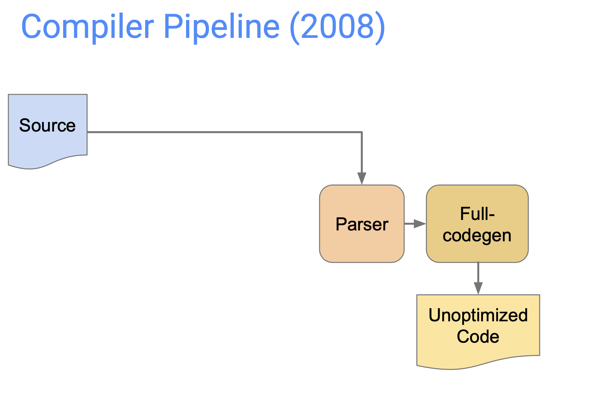
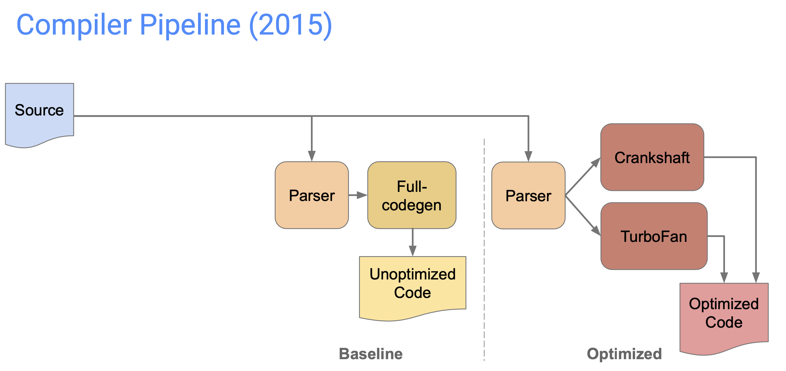
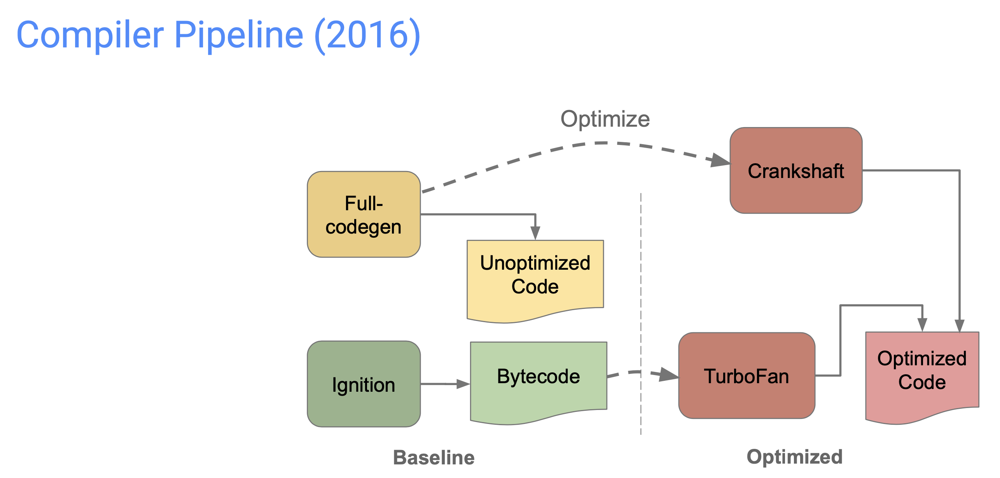
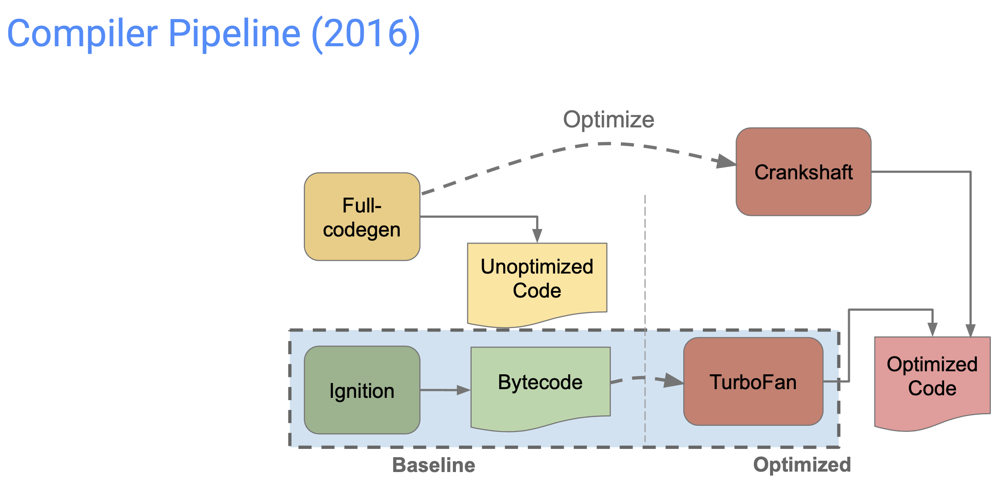
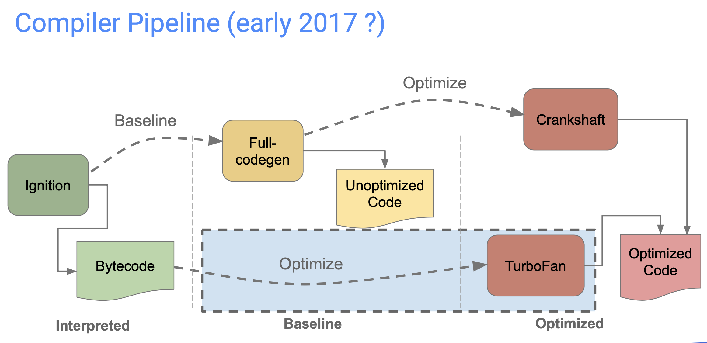
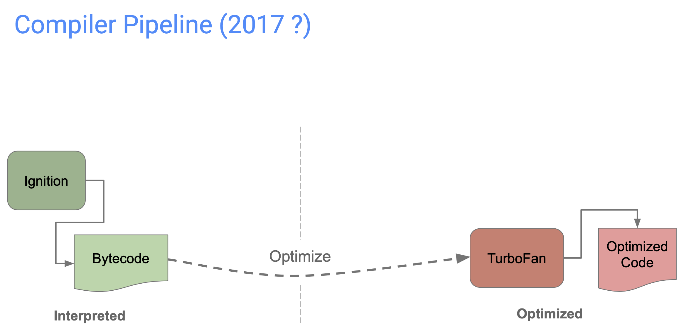
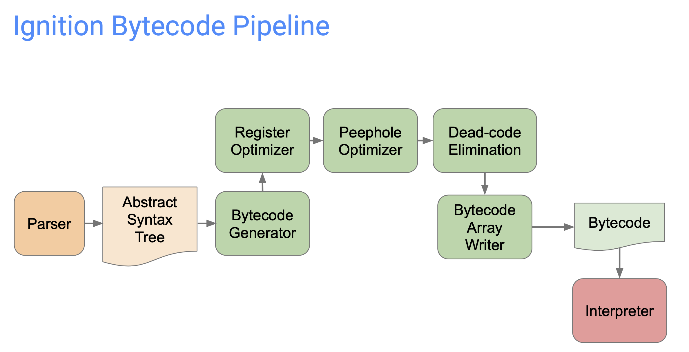
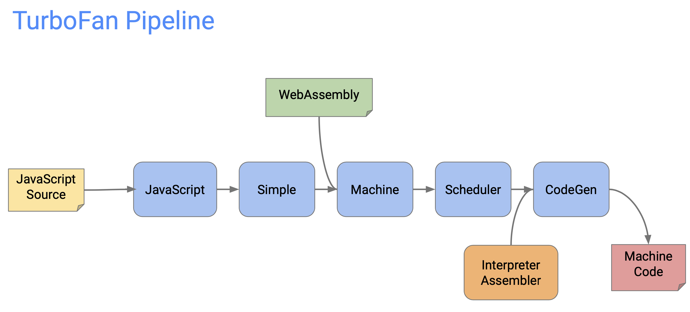

## V8 history

### Full-codegen 阶段
* 最初的发布, 汇编器是 StrongTalk, 性能比其它 js 引擎快 10x, 今天比 2008 年快 10x
* Full-Codegen, 带 IC 的高速 AST 遍历 JIT 编译器

### Crankshaft 阶段
* 引入 Crankshaft 编译器, 引入类型反馈来优化 JIT 编译器
* 必然存在一个 PlanB: 反优化, 在针对性优化前会插入反优化的点
* 存在问题
    * 有些现代的 JS 支持不好, 例如: try-cath, for-of, generators, async/await
    * 严重依赖于反优化, 范优化后性能悬崖存在
    * 受限的静态类型分析和传播
    * 强耦合 Full-codegen
    * 可移植性差(大量手写汇编)

### TurboFan 阶段
* 引入 TurbonFan, 引入类型和范围分析, sea of nodes
* 引入 Sea of Nodes: Control Edge/Value Edge/Effect Edge
    * 释放了大部分操作的计算顺序
    * 只保留了控制流图(CFG)和有状态的操作
    * 由于上面两步, 自然可以更好地消除冗余代码和移动代码
* 三层的 IR(Intermediate Representation)
    * JavaScript: JS 的重载操作符
    * Simplied: VM 操作, 例如分配内存、数字的算术运算
    * Machine: 机器级别的操作, 例如 int32 加法
* 基于类型简化 JS 图
    * 考虑静态类型信息和类型反馈
* 跨平台汇编: CSA(CodeStubAssembler)
* Torque: Torque 编译器不直接生成机器码, 而是生成调用 CSA 的 C++ 代码

InterpreterAssembler => CodeStubAssembler
interpreter-assembler.h

CodeStubAssembler => compiler::CodeAssembler, TorqueGeneratedExportedMacrosAssembler
code-stub-assembler.h

MacroAssembler => TurboAssembler
macro-assembler-x64.h

### Ignition 阶段
* 引入字节码
* 性能必然下降, 为何引入解析器
    * 减少内存使用
        * 编译成字节码比机器码减少 4x
        * 总的代码占用内存减少 2x
    * 减少启动时间(网页)
        * 编译成字节码更快
        * 减少延迟编译的重新解析和优化重新编译
    * 降低复杂度
        * 简化编译流水线
* 以 TurboFan 作为后端
    * 性能没有大损失
    * 支持 100% 的 JS 特性

### SparkPlug 阶段

2021.5.27 SparkPlug 发布, 

资料很多, 但是涉及的方面更多, 而且没有体系化归类整理, 所以不容易了解
