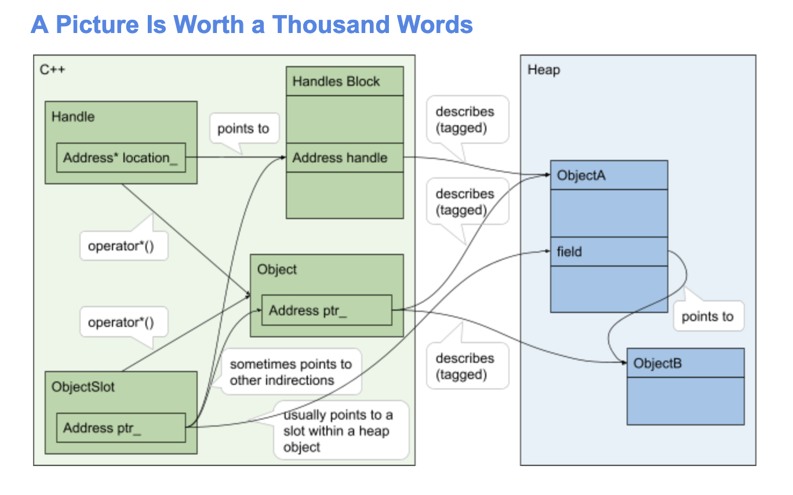

# V8‘s Object Model Using Well-DefinedC ++

## 背景
历史上, V8 使用自定义创建的、非对齐的 Object* 指针来引用堆上的对象, Object** 槽位来作为印象一个对象指针的指针. 这依赖 C++ 未定义的代码模式, 因此我们希望有一个良好定义的替代.

## 设计
### 任意地址(Arbitrary Addresses)
对于任意的原始地址(raw address), 使用**Address**(当前是`uintptr_t`的`typedef`).
逻辑依据: 当我们想完全控制用标记表示的(tagged representation of)一系列事物(当前有: smi, heap object, weak reference)的每一个比特(bit), 或者当我们只是简单地想描述一个没有 C++ 对象的内存位置, 此时我们不应该使用一个指针类型, 而一个整数类型即可. 为了给一个地址添加更多信息的注解(关于类型、对齐等), 他们通常会打包成一个对象

### 对象引用(Object References)
引用对象, 使用**Object**(过去称为"ObjectPtr"), 对 Address 的简单封装, 通常是栈上分配和值传递的

### 对象引用的引用(References to Object References)
引用对象引用, 使用**ObjectSlot**, 这也是对 Address 的一个简单封装. 它是 kPointerSize 对齐的, 你可以解引用它来得到另外一个地址. 不用手动解引用它, 使用接口来获得一个对象

### 句柄(Handles)
对于 GC 安全的对象引用, 也被称为句柄, 使用**Handle**来进行(引用). Handle 和 ObjectSlot 的区别在于后者并不没有 GC 安全的保证.
句柄被模板化为它们所包装的类型, 例如: `Handle<Object>` 或者 `Handle<Map>`.

## 更多细节/FAQ
略
