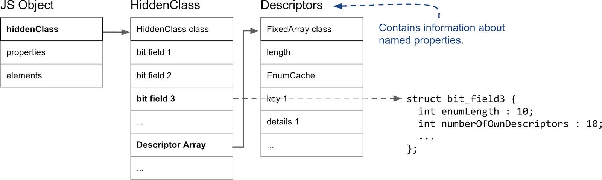

## Fast propperties in V8

### 命名属性 vs. 元素(Named properties vs. elements)
* 每个 JavaScript 对象都有一个关联的隐藏类(HiddenClass)
    * 隐藏类内存储了包括对象形状(Shape)、属性名字到索引的映射, 和其它东西

### 隐藏类和描述符数组(HiddenClasses and DescriptorArrays)

* V8 中所有的堆对象且由 GC 管理的对象, 其第一个字段(fields)都是一个指向隐藏类的指针
* 对于属性(properties)来说, 最重要的是隐藏类的第三个位字段(bit fields), 这里存储了属性的数量, 以及一个指向描述符数组的指针.
* 描述符数组包含命名属性的一些信息, 例如名字本身, 以及值存储的位置. 需要注意的是, 我们不跟踪整数索引的属性
* 隐藏类的基本假设是: <font color=red>相同结构的对象, 例如命名属性的顺序一样, 共享相同的隐藏类.</font> 因此, 当给一个对象增加了一个属性后, 我们会使用一个新的隐藏类
    * V8 会为这些不同的隐藏类创建一个转换树

### 三种不同类型的命名属性
* In-object vs. normal properties
    * in-object 属性: 即直接存储在对象中的属性, 这种是最快的属性(没有间接访问)
        * 对象内属性的数量由对象的初始大小预先决定了
        * 如果添加更多的属性, 则会被存储在属性存储区中(stored in the properties store)
    
* Fast vs. slow properties
    * 我们通常将存储在线性属性存储区(properties store)的属性定义成“快", 这种属性通常通过索引访问
    * 为了根据名字来获得属性在属性存储区中的实际位置, 我们必须访问隐藏类中的描述符数组(descriptor array)
    * 如果对象有很多添加、删除的属性, 这会消耗很多的时间和内存来维护描述符数组和隐藏类. 因此 V8 也支持所谓的"慢"属性
        * 有慢属性的对象会有一个自带的(self-contained)字典来作为属性存储区.
        * 所有的属性元信息都不在存储在隐藏类的描述符数组中, 而是直接存储在属性字典中
        * 属性的添加和删除都不需要更新隐藏类
        * 不过 inline cachees 不能作用域字典属性, 所以比快属性要慢
* 要点总结
    * 三种类型的属性
        * 对象内(in-object): 最快
        * 快属性: 快是相对于慢的, 但是都属于间接属性(在隐藏类的描述符数组中)
        * 慢属性(字典属性)

### 元素或者基于数组索引的属性
* 挤压或者有洞的元素(Packed or Holey Elements)
    ```js
    const o = ['a', 'b', 'c'];
    console.log(o[1]);          // Prints 'b'.

    delete o[1];                // Introduces a hole in the elements store.
    console.log(o[1]);          // Prints 'undefined'; property 1 does not exist.
    o.__proto__ = {1: 'B'};     // Define property 1 on the prototype.

    console.log(o[0]);          // Prints 'a'.
    console.log(o[1]);          // Prints 'B'.
    console.log(o[2]);          // Prints 'c'.
    console.log(o[3]);          // Prints undefined
    ```
    
    简单来说就是, 如果一个属性没有在**receiver**中出现, 我们需要继续在原型链(prototype chain)上查找.
    所以, 如果我们能知道没有空洞, 例如元素是挤压的, 那么我们就可以不用进行代价昂贵的原型链查找

* Fast or Dictionary Elements
    * 快元素(fast elements)是简单的 VM 内部的数组, 属性索引映射到元素存储区(element store)中的索引. 不过对于稀疏数组, 这种存储方式施肥浪费. 此时, 我们使用基于字典的表示方法来节省内存, 代价就是访问速度较慢
        ```js
        const sparseArray = [];
        sparseArray[9999] = 'foo';  // Creates an array with dictionary elements

        // 不能修改是因为 configurable 为 false 吗？
        const array = [];
        Object.defineProperty(array, 0, {value: 'fixed' configurable: false});
        console.log(array[0]);      // Prints 'fixed'.
        array[0] = 'other value';   // Cannot override index 0.
        console.log(array[0]);      // Still prints 'fixed'.
        ```

* Smi and Double elements
    * 小整数和 double 类型的浮点数数组

* 特殊元素(Special Elements)

* 元素访问器(ElementsAccessor)


### 下一步研究
[Super fast super property access](https://v8.dev/blog/fast-super)

### 原文
1. [Fast properties in V8](https://v8.dev/blog/fast-properties)
2. [Elements kinds in V8](https://v8.dev/blog/elements-kinds)
3. [21 different elements kinds](https://source.chromium.org/chromium/v8/v8.git/+/ec37390b2ba2b4051f46f153a8cc179ed4656f5d:src/elements-kind.h;l=14)